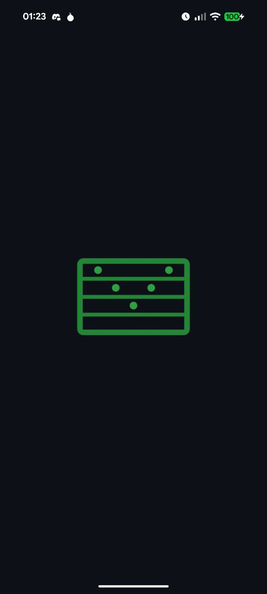
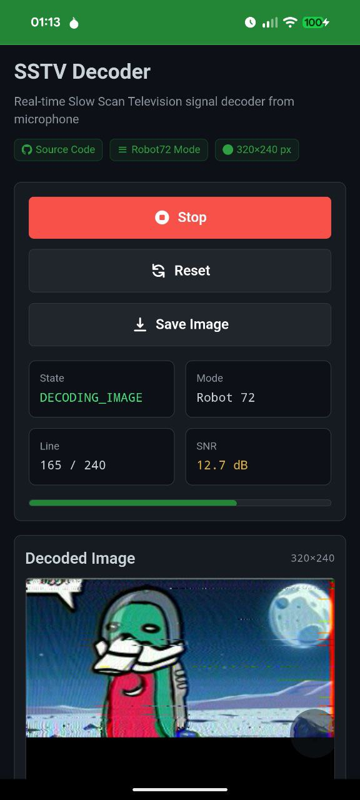
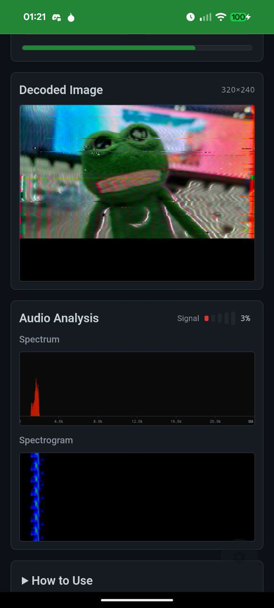
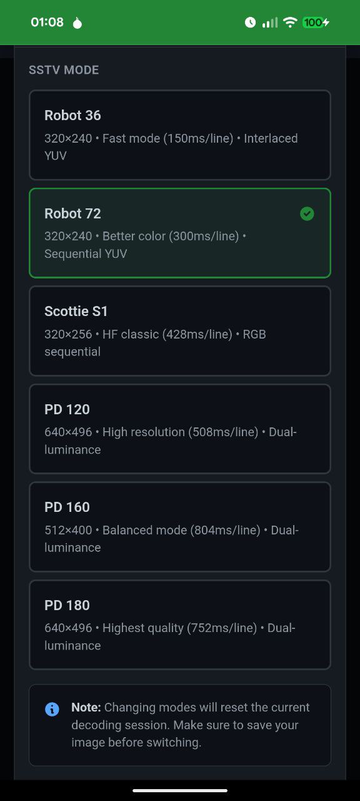

<h1 align="center">
    SSTV Decoder - Web Application
</h3>
<p align="center">
   A web application for real-time SSTV (Slow Scan Television) decoding from microphone input. Supports multiple SSTV modes including Robot36 and PD120. Based on the <a href="https://github.com/xdsopl/robot36">Robot36 Android app</a> by xdsopl.
</p>
<br />

<p align="center">
    <a href="https://github.com/smolgroot/sstv-decoder/stargazers">
        
    </a>
    <a href="https://github.com/smolgroot/sstv-decoder/issues">
        
    </a>
    <a href="https://github.com/smolgroot/sstv-decoder/blob/main/LICENSE">
        
    </a>
    <a href="https://sstv-decoder.vercel.app">
        
    </a>
</p>

<hr>

<p align="center">
   <a href="https://sstv-decoder.vercel.app"><b>🚀 Try the Live Demo</b></a>
</p>

<p float="left">




</p>

## Features

- **Multi-Mode Support**: Robot36 Color (320×240), PD120 (640×496), PD160 (512×400), and PD180 (640×496) with manual mode selection
- **Real-time Audio Processing**: Captures microphone input using Web Audio API (auto-detects 44.1 kHz or 48 kHz)
- **Professional DSP Chain**:
  - FM demodulation with complex baseband conversion
  - Kaiser-windowed FIR lowpass filtering
  - Schmitt trigger sync detection
  - Bidirectional exponential moving average filtering
- **Sync Detection**: Automatic detection of sync pulses (9ms for Robot36, 20ms for PD modes)
- **Live Image Display**: Progressive image rendering with real-time spectrum visualization
- **Mode Selection**: Switch between SSTV modes via settings panel
- **Save Image**: Export decoded images as PNG files
- **Signal Analysis**: Real-time spectrum analyzer and signal strength indicator
- **Mobile-Responsive**: Optimized for both desktop and mobile devices

## Supported SSTV Modes

### Current Implementation

| Mode | Resolution | Sync Pulse | Line Time | Total Time | VIS Code | Status | Documentation |
|------|------------|------------|-----------|------------|----------|---------|---------------|
| **Robot36 Color** | 320×240 | 9ms | ~150ms | ~36s | 8 | ✅ Implemented | [ROBOT36.md](./doc/ROBOT36.md) |
| **Robot72 Color** | 320×240 | 9ms | ~300ms | ~1m 12s | 12 | ✅ Implemented | [ROBOT72.md](./doc/ROBOT72.md) |
| **Scottie S1** | 320×256 | 9ms | ~428ms | ~1m 50s | 60 | ✅ Implemented | [SCOTTIE_S1.md](./doc/SCOTTIE_S1.md) |
| **PD120** | 640×496 | 20ms | ~508ms | ~2m 6s | 95 | ✅ Implemented | [PD120.md](./doc/PD120.md) |
| **PD160** | 512×400 | 20ms | ~804ms | ~2m 41s | 98 | ✅ Implemented | [PD160.md](./doc/PD160.md) |
| **PD180** | 640×496 | 20ms | ~752ms | ~3m 6s | 96 | ✅ Implemented | [PD180.md](./doc/PD180.md) |

### Future Modes (Planned)

The decoder architecture supports adding these modes in future updates:

| Mode | Resolution | Sync Pulse | Line Time | Total Time | VIS Code | Complexity |
|------|------------|------------|-----------|------------|----------|------------|
| **Scottie S2** | 320×256 | 9ms | ~277ms | ~1m 11s | 56 | Medium (RGB sequential) |
| **Scottie DX** | 320×256 | 9ms | ~1069ms | ~4m 34s | 76 | Medium (RGB sequential) |
| **Martin M1** | 320×256 | 5ms | ~446ms | ~1m 54s | 44 | Medium (GBR sequential) |
| **Martin M2** | 320×256 | 5ms | ~226ms | ~58s | 40 | Medium (GBR sequential) |
| **PD50** | 320×256 | 20ms | ~406ms | ~1m 44s | 93 | Low (dual-luma like PD120) |
| **PD90** | 320×256 | 20ms | ~754ms | ~3m 13s | 99 | Low (dual-luma like PD120) |
| **PD240** | 640×496 | 20ms | ~1018ms | ~4m 13s | 97 | Low (dual-luma like PD120) |
| **PD290** | 800×616 | 20ms | ~954ms | ~4m 54s | 94 | Low (dual-luma like PD120) |
| **Wraase SC2-180** | 320×256 | 5ms | ~734ms | ~3m 8s | 55 | Medium (RGB sequential) |

### Mode Selection Guide

**For Quick Transmissions** (under 1 minute):
- **Robot36**: 36 seconds, good quality, standard for QSOs
- **Martin M2**: 58 seconds, RGB sequential, no interlacing
- **Robot72**: 72 seconds, higher quality than Robot36

**For High Quality** (1-3 minutes):
- **PD120**: 2m 6s, 640×496, excellent for ISS SSTV events
- **PD160**: 2m 41s, 512×400, balanced quality and time
- **Scottie S1**: 1m 50s, RGB sequential, clean colors
- **PD180**: 3m 9s, 640×496, extended transmission

**For Maximum Quality** (3+ minutes):
- **PD240**: 4m 13s, 640×496, very high quality
- **PD290**: 4m 54s, 800×616, maximum resolution
- **Scottie DX**: 4m 34s, high quality RGB

### Technical Comparison

| Feature | Robot36/72 | Scottie/Martin | PD Modes |
|---------|------------|----------------|----------|
| **Color Encoding** | Interlaced YUV | Sequential RGB/GBR | Dual-luma YUV |
| **Chroma Strategy** | Alternating R-Y/B-Y per line | Full RGB per line | Shared U/V per 2 rows |
| **Rows per Scan** | 1 row | 1 row | 2 rows |
| **Vertical Subsampling** | 2:1 (interlaced) | None (1:1) | 2:1 (shared chroma) |
| **Complexity** | Medium (interlacing) | Low (sequential) | Low (dual-luma) |
| **ISS Usage** | Rare | Occasional | Very Common (PD120) |

## Technology Stack

- **Next.js 15**: React framework with App Router
- **TypeScript**: Type-safe development
- **Web Audio API**: Real-time audio capture and processing
  - ScriptProcessorNode (Chrome, Firefox, Edge)
  - requestAnimationFrame polling (Safari, iOS)
- **Canvas API**: Progressive image rendering
- **Tailwind CSS**: Utility-first styling

## Testing

The project includes comprehensive unit tests for the core SSTV decoding algorithms.

### Running Tests

```bash
# Run all tests
npm test

# Run tests in watch mode (for development)
npm run test:watch

# Run tests with coverage report
npm run test:coverage
```

### Test Framework

- **Jest** - Test runner with TypeScript support
- **@testing-library/react** - React component testing utilities
- **jsdom** - DOM environment for tests

## Getting Started

### Prerequisites

- Node.js 18+ installed
- A modern web browser with microphone access

### Installation

1. Clone the repository:
```bash
git clone <repository-url>
cd sstv-decoder
```

2. Install dependencies:
```bash
npm install
```

3. Run the development server:
```bash
npm run dev
```

4. Open [http://localhost:3000](http://localhost:3000) in your browser

### Building for Production

```bash
npm run build
npm start
```

## How to Use

1. **Select Mode** (Optional): Click the settings icon (bottom-right) to choose between available SSTV modes
   - Robot36: 320×240, fastest decode (~36 seconds)
   - Robot72: 320×240, better color than Robot36 (~72 seconds)
   - Scottie S1: 320×256, HF classic, RGB sequential (~1m 50s)
   - PD120: 640×496, high resolution (~2 minutes), used for ISS SSTV
   - PD160: 512×400, balanced mode (~2m 41s), good SNR
   - PD180: 640×496, highest quality (~3 minutes), best SNR
2. **Start Decoding**: Click "Start Decoding" to begin capturing audio from your microphone
3. **Grant Microphone Permission**: Allow the browser to access your microphone when prompted
4. **Play SSTV Signal**: Play an SSTV signal near your microphone (from radio, audio file, signal generator, etc.)
5. **Watch Live Decoding**: The decoded image will appear progressively on the canvas
6. **Monitor Signal**: Check the spectrum analyzer and signal strength indicator for optimal reception
7. **Reset**: Click "Reset" to clear the canvas and start a new decode
8. **Save Image**: Click "Save Image" to download the decoded image as a PNG file
   - Filename format: `sstv-decode-{mode}-{TIMESTAMP}.png`
   - Example: `sstv-decode-robot36-2024-03-15-143022.png`
9. **Stop**: Click "Stop" to end the decoding session (image remains visible for saving)

## Technical Details

### Signal Processing Chain

1. **Baseband Conversion**: Complex multiplication at center frequency (1900 Hz)
2. **Baseband Lowpass Filter**: Kaiser-windowed FIR filter (2ms length, 900 Hz cutoff)
3. **FM Demodulation**: Phase difference detection with scale factor (sampleRate / (bandwidth × π))
4. **Sync Detection**: Schmitt trigger detecting frequency drops to 1200 Hz
5. **Line Decoding**: Bidirectional exponential moving average filtering for horizontal resolution

### Audio Parameters

- **Sample Rate**: Auto-detected (44.1 kHz or 48 kHz, matches browser/hardware)
- **Center Frequency**: 1900 Hz (midpoint of 1000-2800 Hz range)
- **Bandwidth**: 800 Hz (white-black range: 2300-1500 Hz)
- **Sync Frequency**: 1200 Hz (normalized to -1.750)
- **Schmitt Trigger**: Low threshold = -1.563 (1275 Hz), High threshold = -1.375 (1350 Hz)

### Robot36 Color Mode Specifications

- **Resolution**: 320×240 pixels
- **Color Format**: Interlaced YUV (even lines: Y + R-Y, odd lines: Y + B-Y)
- **Line Duration**: ~150ms per scan line
- **Sync Pulse**: 9ms at 1200 Hz
- **Sync Porch**: 3ms at 1500 Hz
- **Luminance (Y)**: 88ms
- **Separator**: 4.5ms (frequency indicates even/odd line)
- **Porch**: 1.5ms
- **Chrominance (R-Y or B-Y)**: 44ms
- **Total Lines**: 240 (produces 240 pixel rows, 120 even + 120 odd pairs)
- **Encoding**: 1 row per scan line (interlaced chroma pairing)

### PD120 Mode Specifications

- **Resolution**: 640×496 pixels
- **Color Format**: Dual-luminance YUV (Y-even + V-avg + U-avg + Y-odd)
- **Scan Line Duration**: ~508ms per scan line
- **Sync Pulse**: 20ms at 1200 Hz
- **Sync Porch**: 2.08ms at 1500 Hz
- **Y-even Channel**: 121.6ms (luminance for even row)
- **V-avg Channel**: 121.6ms (R-Y chroma, shared)
- **U-avg Channel**: 121.6ms (B-Y chroma, shared)
- **Y-odd Channel**: 121.6ms (luminance for odd row)
- **Pixel Dwell Time**: 190µs per pixel
- **Total Scan Lines**: 248 (produces 496 pixel rows, 248 × 2)
- **Encoding**: 2 rows per scan line (shared chroma between rows)

### PD160 Mode Specifications

- **Resolution**: 512×400 pixels
- **Color Format**: Dual-luminance YUV (Y-even + V-avg + U-avg + Y-odd)
- **Scan Line Duration**: ~804ms per scan line
- **Sync Pulse**: 20ms at 1200 Hz
- **Sync Porch**: 2.08ms at 1500 Hz
- **Y-even Channel**: 195.584ms (luminance for even row)
- **V-avg Channel**: 195.584ms (R-Y chroma, shared)
- **U-avg Channel**: 195.584ms (B-Y chroma, shared)
- **Y-odd Channel**: 195.584ms (luminance for odd row)
- **Pixel Dwell Time**: 382µs per pixel (2× longer than PD120)
- **SNR Improvement**: ~3.0 dB better than PD120
- **Total Scan Lines**: 200 (produces 400 pixel rows, 200 × 2)
- **Encoding**: 2 rows per scan line (shared chroma between rows)

### PD180 Mode Specifications

- **Resolution**: 640×496 pixels
- **Color Format**: Dual-luminance YUV (Y-even + V-avg + U-avg + Y-odd)
- **Scan Line Duration**: ~752ms per scan line
- **Sync Pulse**: 20ms at 1200 Hz
- **Sync Porch**: 2.08ms at 1500 Hz
- **Y-even Channel**: 182.4ms (luminance for even row)
- **V-avg Channel**: 182.4ms (R-Y chroma, shared)
- **U-avg Channel**: 182.4ms (B-Y chroma, shared)
- **Y-odd Channel**: 182.4ms (luminance for odd row)
- **Pixel Dwell Time**: 286µs per pixel (50% longer than PD120)
- **SNR Improvement**: ~1.8 dB better than PD120
- **Total Scan Lines**: 248 (produces 496 pixel rows, 248 × 2)
- **Encoding**: 2 rows per scan line (shared chroma between rows)

### Sync Detection

- **9ms Pulses**: Robot36/Scottie scan line sync
- **20ms Pulses**: PD mode scan line sync
- **5ms Pulses**: Martin mode sync / VIS calibration headers
- **Frequency Tolerance**: ±0.125 normalized units (~50 Hz at 1900 Hz center)
- All timing automatically adapts to detected sample rate (44.1 kHz or 48 kHz)
- Mode-specific pulse width detection ensures correct decoder selection

### Image Export

- Format: PNG (lossless compression)
- Resolution: Matches selected SSTV mode
- Filename: Includes mode and timestamp for easy identification
- Method: Canvas.toBlob() API for efficient conversion

## Project Structure

```
src/
├── app/
│   ├── layout.tsx              # Root layout with metadata
│   ├── page.tsx                # Home page with mode state management
│   └── globals.css             # Global Tailwind styles
├── components/
│   ├── SSTVDecoder.tsx         # Main decoder UI component
│   └── SettingsPanel.tsx       # Mode selection settings panel
├── hooks/
│   └── useAudioProcessor.ts    # Web Audio API integration (mode-aware)
└── lib/
    └── sstv/
        ├── constants.ts             # SSTV mode specifications (Robot36, Robot72, Scottie S1, PD120, PD160, PD180)
        ├── decoder.ts               # Main decoder orchestration (multi-mode)
        ├── sync-detector.ts         # Sync pulse detection (9ms/20ms)
        ├── robot36-line-decoder.ts  # Robot36 interlaced YUV decoder
        ├── robot72-line-decoder.ts  # Robot72 sequential YUV decoder (better color)
        ├── scottie-s1-line-decoder.ts # Scottie S1 RGB sequential decoder (HF classic)
        ├── pd120-line-decoder.ts    # PD120 dual-luminance decoder
        ├── pd160-line-decoder.ts    # PD160 dual-luminance decoder (balanced mode)
        ├── pd180-line-decoder.ts    # PD180 dual-luminance decoder (high quality)
        ├── fm-demodulator.ts        # DSP primitives (FM demod, filters, EMA)
        └── dsp.ts                   # Legacy utilities (deprecated)

doc/
├── ROBOT36.md                  # Robot36 technical specification
├── ROBOT72.md                  # Robot72 technical specification
├── SCOTTIE_S1.md               # Scottie S1 technical specification
├── PD120.md                    # PD120 technical specification
├── PD160.md                    # PD160 technical specification
├── PD180.md                    # PD180 technical specification
└── ARCHITECTURE.md             # Overall system architecture
```

## Browser Compatibility

### Desktop Browsers

| Browser | Status | Notes |
|---------|--------|-------|
| **Chrome** 90+ | ✅ Full Support | Uses ScriptProcessorNode for audio processing |
| **Edge** 90+ | ✅ Full Support | Chromium-based, same as Chrome |
| **Firefox** 88+ | ✅ Full Support | Automatic sample rate matching (44.1kHz or 48kHz) |
| **Safari** 14+ | ✅ Full Support | Uses requestAnimationFrame polling fallback |
| **Opera** 76+ | ✅ Full Support | Chromium-based, same as Chrome |

### Mobile Browsers

| Browser | Status | Notes |
|---------|--------|-------|
| **Safari (iOS)** 14.5+ | ✅ Full Support | Uses requestAnimationFrame polling (ScriptProcessorNode deprecated) |
| **Chrome (Android)** 90+ | ✅ Full Support | Full ScriptProcessorNode support |
| **Firefox (Android)** 88+ | ✅ Full Support | Automatic sample rate matching |
| **Samsung Internet** | ✅ Full Support | Chromium-based |

### Requirements

- **HTTPS Required**: Microphone access requires secure context (HTTPS)
  - Exception: `localhost` works with HTTP for development
- **Microphone Permission**: User must grant microphone access when prompted
- **Web Audio API**: All supported browsers have Web Audio API enabled by default

### Technical Implementation

The app uses a **dual-strategy approach** for maximum compatibility:

1. **ScriptProcessorNode** (deprecated but widely supported):
   - Used in Chrome, Firefox, Edge, and older Safari versions
   - Processes audio in 4096-sample chunks
   - Efficient and low-latency

2. **requestAnimationFrame Polling** (modern Safari/iOS fallback):
   - Automatically used when ScriptProcessorNode is unavailable
   - Polls `AnalyserNode.getFloatTimeDomainData()` at 60fps
   - 2048 samples per frame (~34ms latency)
   - Required for Safari iOS 14+ where ScriptProcessorNode is broken

3. **Dynamic Sample Rate**:
   - Automatically adapts to browser's native sample rate (44.1kHz or 48kHz)
   - Required for Firefox compatibility
   - All DSP calculations scale accordingly


## Implementation Notes

This implementation closely follows the [Robot36 Android app](https://github.com/xdsopl/robot36) by Ahmet Inan (xdsopl), translating the Java implementation to TypeScript while maintaining the same DSP algorithms:

- **FM Demodulation**: Complex baseband conversion with phase difference calculation
- **Lowpass Filtering**: Kaiser-windowed FIR filter matching Java's `ComplexConvolution`
- **Sync Detection**: Schmitt trigger logic from `Robot_36_Color.java`
- **Line Decoding**: Bidirectional exponential moving average filter with proper cutoff formula
- **Color Conversion**: ITU-R BT.601 YUV to RGB transformation with interlaced chrominance

### Known Issues

- Occasional false sync detections from noise/interference
- Stack overflow on very long lines (>6 seconds) - indicates lost sync
- Best results with clean, strong signals from radio or audio playback
- Safari iOS may have slightly higher latency (~34ms) due to polling approach

## Future Improvements

### High Priority
- [ ] **VIS Code Detection**: Automatic mode selection based on VIS header detection
- [ ] **Additional PD Modes**: PD50, PD90, PD240, PD290 (low complexity, similar to PD120/PD180)
- [ ] **Audio File Upload**: Decode from WAV/MP3 files for offline processing

### Medium Priority
- [ ] **Scottie Modes**: S1, S2, DX (RGB sequential encoding)
- [ ] **Martin Modes**: M1, M2 (GBR sequential encoding)
- [ ] **Wraase SC2-180**: High-quality RGB mode
- [ ] **Improved Noise Reduction**: Advanced filtering for weak signals
- [ ] **Signal Quality Metrics**: SNR calculation and display

### Low Priority
- [ ] **Waterfall Display**: Full spectrogram history
- [ ] **Multi-image Gallery**: Store and compare multiple decoded images
- [ ] **Export Metadata**: Include mode, timestamp, signal quality in saved files

## Contributing

I welcome contributions! Please see [CONTRIBUTING.md](CONTRIBUTING.md) for guidelines on:

- Setting up your development environment
- Creating feature branches
- Writing and running tests
- Code quality standards
- Submitting pull requests
- Adding new SSTV modes

## License

This project is based on [Robot36](https://github.com/xdsopl/robot36) by Ahmet Inan, which is licensed under the 0BSD license (Zero-Clause BSD).

## Acknowledgments

- **Ahmet Inan (xdsopl)**: Original [Robot36 Android app](https://github.com/xdsopl/robot36) and DSP algorithms
- **Amateur Radio SSTV Community**: Protocol specifications and documentation

## Reference Implementation

This web implementation is based on the algorithms from the original [Robot36 Android app](https://github.com/xdsopl/robot36) by Ahmet Inan. If you're interested in the reference Java implementation, please visit the original repository.
